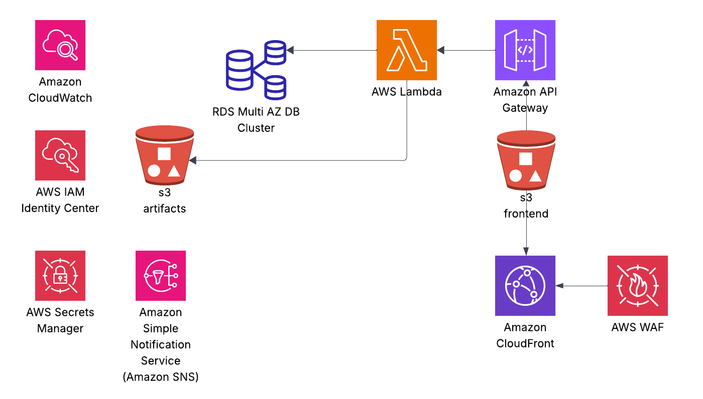
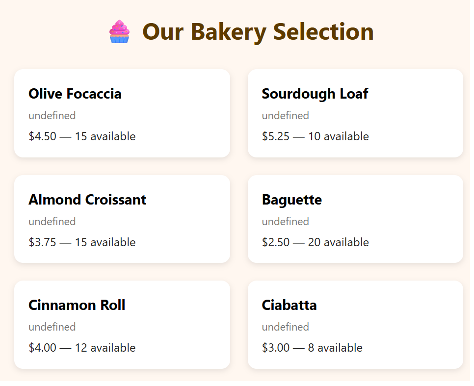

# 🛒 E-Commerce Infrastructure — LocalStack Edition

A full-stack, local-first ecommerce platform modeled on production-grade AWS architecture: scalable, observable, and fully reproducible via Terraform.

---

## 📐 Architecture Overview

[](./docs/CloudArchitecture.png)

**Traffic Flow**:

1. 🔒 **WAF** protects the edge and filters malicious requests  
2. 🌐 **CloudFront** serves static pages and routes dynamic traffic  
3. 🗂️ **S3** hosts static frontend (`index.html`, JS, CSS)  
4. 🔗 **API Gateway v2** exposes `/products` routes secured via `x-api-key`  
5. ⚙️ **Lambda (FastAPI)** handles dynamic logic  
6. 🛢️ **RDS PostgreSQL** stores product data (multi-AZ, managed by Terraform)  
7. 📦 **S3 Artifact Bucket** stores Lambda deployment packages  
8. 📊 **CloudWatch Dashboards + Alarms** for observability  
9. 📣 **SNS Topics** for operational alerts  
10. 🔑 **Secrets Manager** stores sensitive DB credentials  
11. 👤 **IAM Roles** restrict and delegate service access  

AWS-native, highly available, and ready for real-world production—or simulated entirely via [LocalStack](https://localstack.cloud) for local dev.

---

## 🧱 Project Structure

```
.
├── app/                      # Lightweight Python test app
├── product_api/              # Lambda FastAPI application package
├── terraform/                # Terraform root config
│   └── modules/              # Reusable Terraform modules
├── frontend/index.html       # Static storefront
├── seed_products.py          # Seeder for PostgreSQL product table
└── docker-compose.yml        # Docker compose for reference.
```

---

## ⚙️ Prerequisites

- Docker & Docker Compose  
- [LocalStack](https://docs.localstack.cloud/) (Pro required)  
- Terraform ≥ 1.5  
- Python ≥ 3.9  
- `awslocal` CLI or alias for `aws --endpoint-url`

---

## 🧪 Local Dev Setup

### 1. Launch LocalStack

```bash
docker-compose up -d
```

> ℹ️ `docker-compose.yml` includes necessary services for routing and networking

---

### 2. Deploy Infrastructure

```bash
cd terraform
terraform init
terraform apply -auto-approve
```

Make sure AWS credentials are **unset**:

```bash
unset AWS_PROFILE AWS_ACCESS_KEY_ID AWS_SECRET_ACCESS_KEY
```

---

### 3. Seed the Product Database

```bash
python seed_products.py
```

---

### 4. Deploy the Frontend

```bash
make frontend
```

---

### 5. View the Storefront

```
http://<bucket>.s3-website.localhost.localstack.cloud:4566
```

Use `terraform output bucket_name` to find your bucket name.

---

## 🚦 Operational Notes

- FastAPI handles CORS and API key validation.
- - APIs implemented: get products, get product (id), create product, update product, delete product
- WAF rules are extendable via Terraform module  
- RDS is mocked in LocalStack behind Dockerized PostgreSQL  
- IAM enforces scoped service access  
- CloudWatch + SNS provide observability and alerting

---

## 🔥 Production-Ready Patterns

- Secrets stored securely in Secrets Manager  
- Artifact packaging via S3 for Lambda  
- OAI restricts S3 access to CloudFront  
- Modules support multi-env deployment  
- DR via RDS snapshots and cross-region replication

---

## 🧹 Cleanup

```bash
make destroy
# or
terraform destroy -auto-approve
```

[](./docs/storefront.png)
---

## 📬 Contact & License

MIT License © [@amaryeh](https://github.com/amaryeh)
