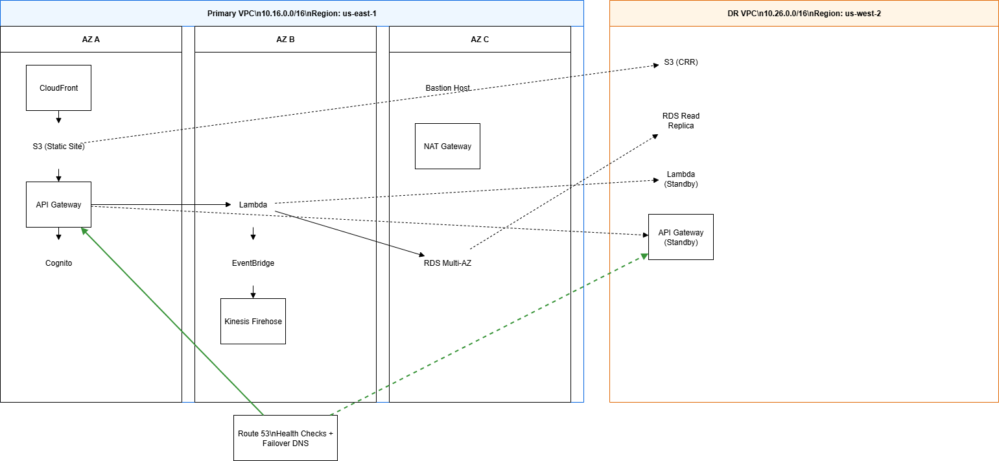

# 🛒 E-Commerce Infrastructure (LocalStack)

## 📐 System Architecture

[](./docs/architecture.png)

This repository contains the infrastructure-as-code setup for an e-commerce backend, built using Terraform and running entirely on [LocalStack](https://localstack.cloud/). It includes:

- 🖥️ Modular Lambda functions for API handling  
- 🔒 IAM roles with scoped permissions  
- 🔗 API Gateway integration  
- 🛢️ RDS instance with credential management  
- 📊 CloudWatch dashboard and alarms  
- 📣 SNS-based alerting system  
- 🧪 Local development with Docker + LocalStack  

---

## 🏗️ Project Structure

├── terraform/ │ ├── main.tf │ ├── modules/ │ │ ├── lambda/ │ │ ├── monitoring/ │ │ ├── sns/ │ │ └── dashboard/ ├── README.md ├── .gitignore


---

## 🚀 Getting Started

### 1. Start LocalStack

Make sure LocalStack is running (Docker required):

```bash
localstack start

Or use Docker Compose if configured.

### 2. Initialize & Deploy

cd terraform
terraform init
terraform plan
terraform apply

⚙️ Environment Variables
Ensure no real AWS credentials are exported in your shell. You may want to unset any of these:

unset AWS_PROFILE
unset AWS_ACCESS_KEY_ID
unset AWS_SECRET_ACCESS_KEY

